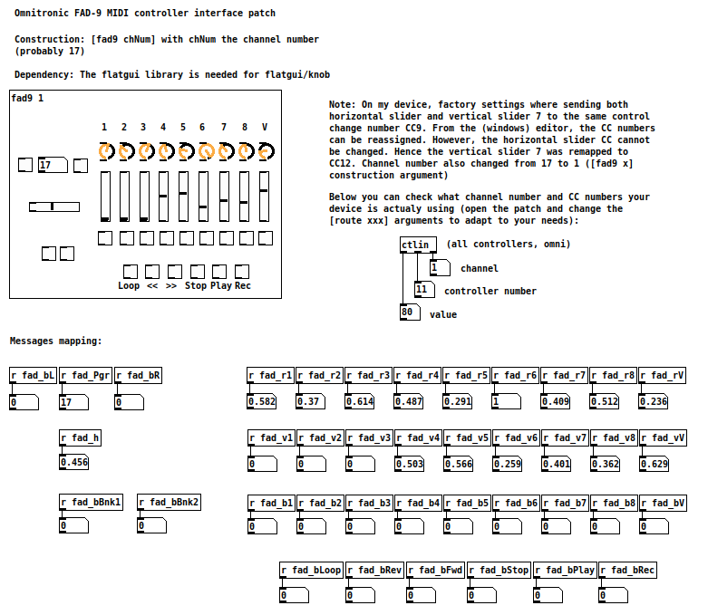

# FAD9
## PureData interface patch for Omnitronic FAD-9

`fad9`is a Pure Data patch to interface the cheap Omnitronic FAD-9 MIDI controller. You may need to adapt your controller numbers etc...

The `flatgui` library is required.

